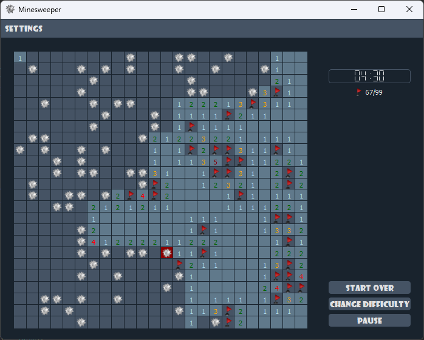
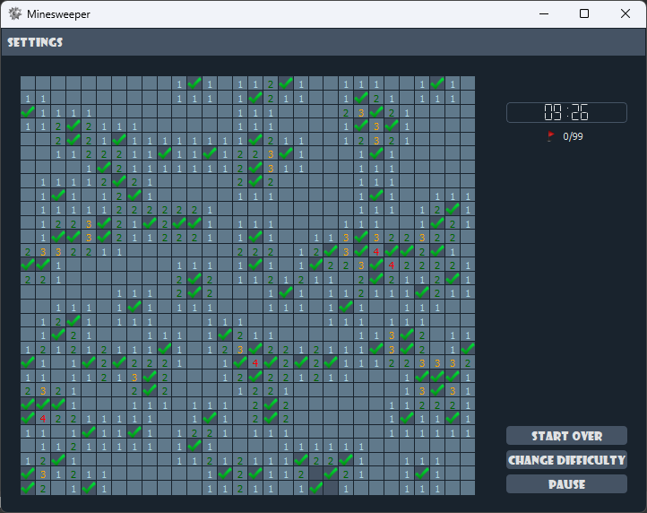
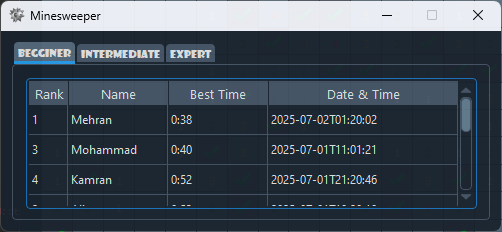

# 💣 Minesweeper

 
 

 

A modern implementation of the classic Minesweeper game built with Qt and C++, featuring customizable gameplay, and high score tracking.

## ✨ Features

- **Three difficulty levels**:
  - Beginner (9×9 grid with 10 mines)
  - Intermediate (16×16 grid with 40 mines)
  - Expert (24×24 grid with 99 mines)
  
- **Custom mode** - Create your own board size and mine count
- **High score system** - Track your best times for each difficulty
- **Responsive UI** - Adapts to window resizing

## 🎮 Gameplay

- Left-click to reveal a square
- Right-click to place/remove a flag
- Clear the board without hitting mines to win
- Numbers show how many mines are adjacent
- Complete the game with all mines flagged to record your score

## 📦 Dependencies
- Qt 5 or later
- C++17 compatible compiler

## 🚀 Getting Started
- Clone the repository
- Open the project in Qt Creator
- Build and run

## 📸 Screenshots

 

